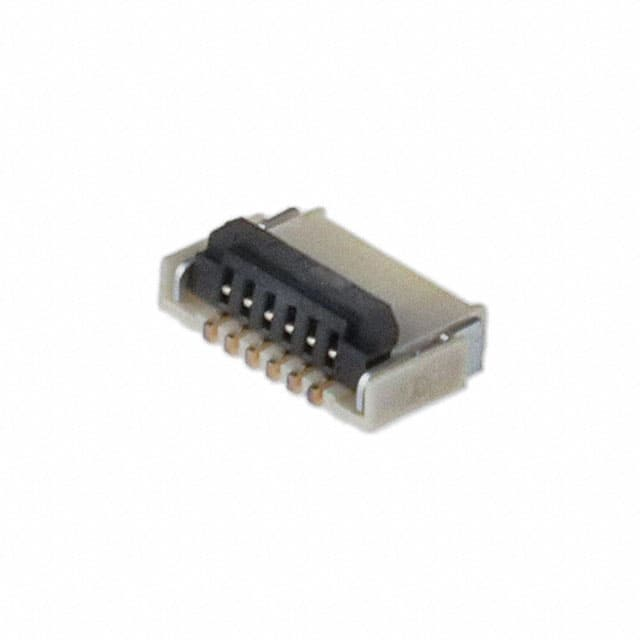
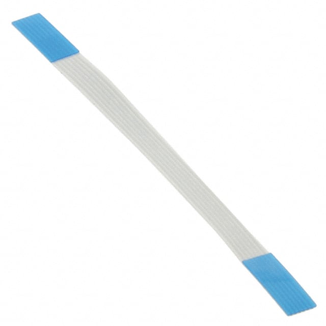
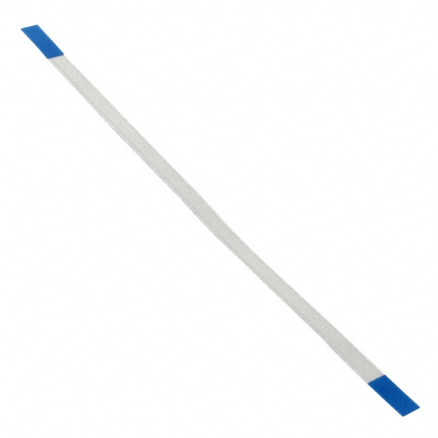

# 6 Position FPC Connector Contacts, Top and Bottom 0.020" (0.50mm) Surface Mount, Right Angle

Links:

- https://www.digikey.com/en/products/detail/te-connectivity-amp-connectors/2328702-6/9565575
- https://www.digikey.ca/en/products/detail/te-connectivity-amp-connectors/2328702-6/9565575

-------
# 6 Position FFC, FPC Cable 0.020" (0.50mm) 1.970" (50.04mm)

Links:

- https://www.digikey.com/en/products/detail/würth-elektronik/687606050002/2811273
- https://www.digikey.ca/en/products/detail/würth-elektronik/687606050002/2811273

-------
# 6 Position FFC, FPC Cable 0.020" (0.50mm) 3.940" (100.08mm)

Alternatively, if you find the 50mm cable is too short, you can use this 100mm version instead.

Links:

- https://www.digikey.com/en/products/detail/würth-elektronik/687606100002/4573376
- https://www.digikey.ca/en/products/detail/würth-elektronik/687606100002/4573376
