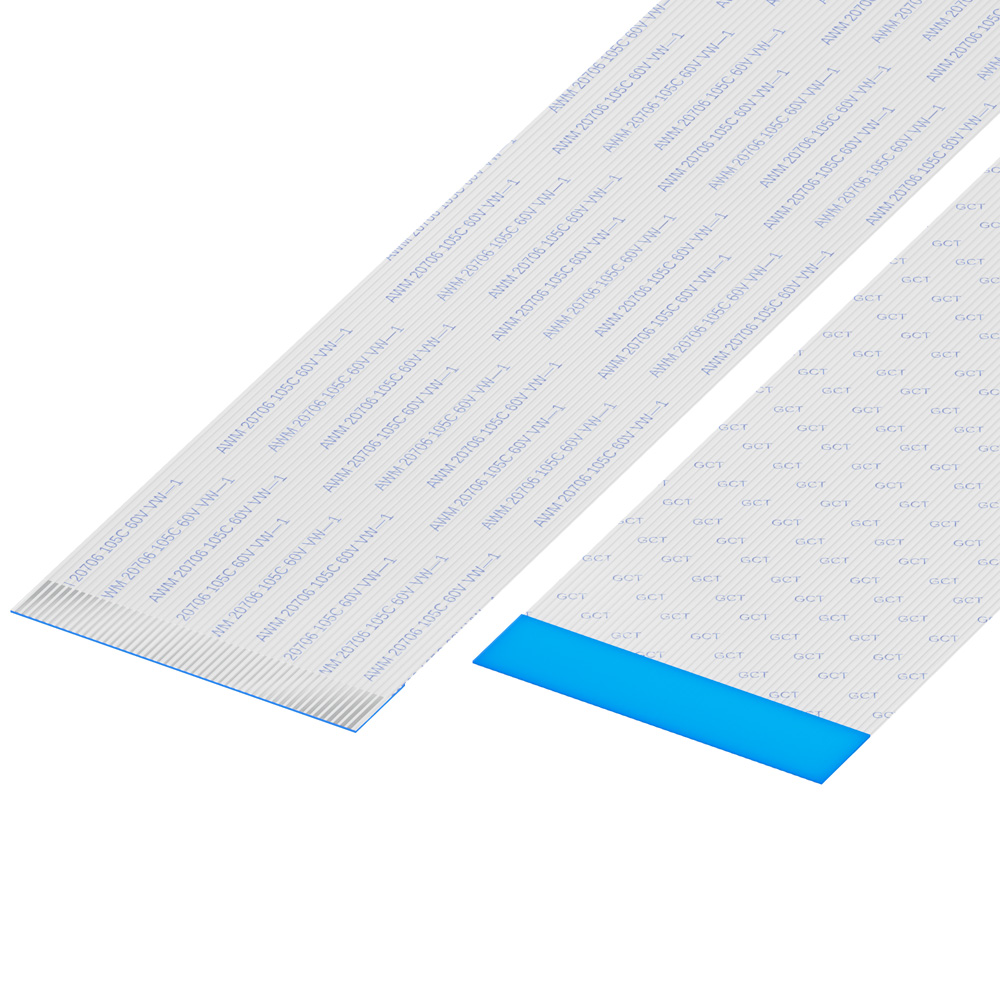

# Flat Flex Cable

- Pitch: 0.5mm
- 50-pin
- Length: 203mm/8inch
- Exposed End: 4mm
- Type B

*Type B means the two ends of the cable are different when laying down flat.*

DigiKey US
- https://www.digikey.com/en/products/detail/gct/21266617
- https://www.digikey.com/short/4mpwfdf3

DigiKey Canada
- https://www.digikey.ca/en/products/detail/gct/21266617
- https://www.digikey.ca/short/tw9bbdz0

*Any FFC that matches all the specs should work.*
