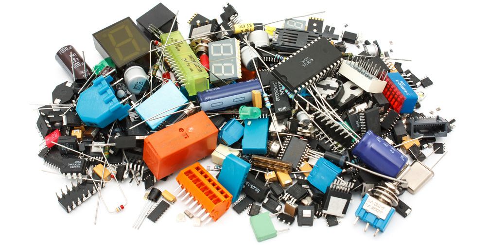

# Jeff's Parts Library



I found that it's not a great idea to put individual links to parts in each and every building guides that I have. Over time, these link will slowly become invalid and the guide would not work anymore.

Instead, it makes more sense if there's a centralized repository so if something is ever changed, it can be updated from one single point. So here it is.

------------

## Quick Copy Markdown Code

For quickly copy & paste into guides.

------------

### Connectors
```
VGA Port Slim, Female - [Link](https://github.com/jeffqchen/JeffParts/blob/main/Connectors/HD15/Slim/Female%20PCB/info.md)

VGA Port Slim, Male - [Link](https://github.com/jeffqchen/JeffParts/blob/main/Connectors/HD15/Slim/Male%20PCB/info.md)

3.5mm Headphone Jack, Vertical - [Link](https://github.com/jeffqchen/JeffParts/blob/main/Connectors/3.5mm%20Audio%20Jack/Vertical%205-Pin%20PCB/info.md)

3.5mm Headphone Jack, Horizontal - [Link](https://github.com/jeffqchen/JeffParts/blob/main/Connectors/3.5mm%20Audio%20Jack/Horizontal%203-Pin%20PCB/info.md)

3.5mm Audio Jack, panel mount - [Link](https://github.com/jeffqchen/JeffParts/blob/main/Connectors/3.5mm%20Audio%20Jack/Panel%20Mount/info.md)

8 pin Mini DIN Male Plug, Cable Type - [Link](https://github.com/jeffqchen/JeffParts/blob/main/Connectors/Mini%20DIN/8Pin/Cable/info.md)

8 pin Mini DIN Male Plug, PCB Type - [Link](https://github.com/jeffqchen/JeffParts/blob/main/Connectors/Mini%20DIN/8Pin/Through%20Hole/info.md)

9 pin Mini DIN Male Plug, Cable Type - [Link](https://github.com/jeffqchen/JeffParts/blob/main/Connectors/Mini%20DIN/9Pin/Cable/info.md)

9 pin Mini DIN Male Plug, Through-Hole Type - [Link]
(https://github.com/jeffqchen/JeffParts/blob/main/Connectors/Mini%20DIN/9Pin/Through%20Hole/info.md)

10 pin Mini DIN Male Plug, Through-Hole Type - [Link]
(https://github.com/jeffqchen/JeffParts/blob/main/Connectors/Mini%20DIN/10Pin/Through%20Hole/info.md)

PlayStation Controller Port - [Link](https://github.com/jeffqchen/JeffParts/blob/main/Connectors/PlayStation%20Controller%20Port/info.md)

DB9 Port - [Link](https://github.com/jeffqchen/JeffParts/blob/main/Connectors/DB9/Male%20PCB/info.md)

Nintendo AV Plug - [Link](https://github.com/jeffqchen/JeffParts/blob/main/Connectors/Nintendo%20AV%20Plug/info.md)

Dreamcast AV Plugs - [Link](https://github.com/jeffqchen/JeffParts/blob/main/Connectors/Dreamcast%20AV%20Plug/info.md)

PlayStation AV Multi Plug, Male - [Link](https://github.com/jeffqchen/JeffParts/blob/main/Connectors/PlayStation%20AV%20Multi%20Plug/info.md)

SCART Male Plug, Cable Type - [Link](https://github.com/jeffqchen/JeffParts/blob/main/Connectors/SCART/Male%20Cable/info.md)

BNC Header, Female, Panel Mount 75/50 Ohm- [Link](https://github.com/jeffqchen/JeffParts/blob/main/Connectors/BNC%20Header/Panel%20Mount/Female/info.md)

HDMI Female Socket, Through Hole - [Link](https://github.com/jeffqchen/JeffParts/blob/main/Connectors/HDMI/Female/PCB/info.md)

HDMI Ports, Modular - [Link](https://github.com/jeffqchen/JeffParts/blob/main/Connectors/HDMI/Modular/info.md)

Terminal Pins, Male, Machined - [Link](https://github.com/jeffqchen/JeffParts/blob/main/Connectors/Terminal%20Pins/Machined%20Male/info.md)

Terminal Pins, Female, Machined - [Link](https://github.com/jeffqchen/JeffParts/blob/main/Connectors/Terminal%20Pins/Machined%20Female/info.md)

2.54mm-Pitched Pin Header, Right Angle  - [Link](https://github.com/jeffqchen/JeffParts/blob/main/Connectors/Pin%20Header/2.54mm%20Pitch/Male%20Right-Angle/info.md)

2.54mm-Pitched Pin Header, Straight - [Link](https://github.com/jeffqchen/JeffParts/blob/main/Connectors/Pin%20Header/2.54mm%20Pitch/Male%20Straight/info.md)

1.27mm-Pitched Female Pin Header, Double Row, SMD - [Link](https://github.com/jeffqchen/JeffParts/blob/main/Connectors/Pin%20Header/1.27mm%20Pitch/Female%20SMD/info.md)

1.27mm-Pitched Male Pin Header, Double Row, Straight, Through Hole - [Link](https://github.com/jeffqchen/JeffParts/blob/main/Connectors/Pin%20Header/1.27mm%20Pitch/Male%20Straight/info.md)

RCA Jack, Female - [Link](https://github.com/jeffqchen/JeffParts/blob/main/Connectors/RCA%20Jack/info.md)

6 Position 0.5mm Pitch FPC & Connector - [Link](https://github.com/jeffqchen/JeffParts/blob/main/Connectors/6%20Position%200.5mm%20Pitch%20FPC%20%26%20Connector/info.md)

PJ-002A Barrel Jack, OD 5.50mm / ID 2.10mm - [Link](https://github.com/jeffqchen/JeffParts/blob/main/Connectors/Barrel%20Jack/PJ-002A/info.md)

1705951 RJ45 Ethernet Jack, Female - [Link](https://github.com/jeffqchen/JeffParts/blob/main/Connectors/RJ45/Female/1705951/info.md)
```

------------

### Components

```
220uF / 6.3V / Imperial 1206 Size - [Link](https://github.com/jeffqchen/JeffParts/blob/main/Components/220uF%20SMD%20Cap/info.md)

100uF / 6.3V / Imperial 1206 Size - [Link](https://github.com/jeffqchen/JeffParts/blob/main/Components/100uF%20SMD%20Cap/info.md)

MC74HC86ADTR2G Quad XOR Gate - [Link](https://github.com/jeffqchen/JeffParts/blob/main/Components/MC74HC86ADTR2G%20Quad%20XOR%20Gate/info.md)

LM1881M Sync Separator / 8-SOIC - [Link](https://github.com/jeffqchen/JeffParts/blob/main/Components/LM1881M%20Sync%20Separator/info.md)

ISL59885ISZ HD Sync Separator / 8-SOIC - [Link](https://github.com/jeffqchen/JeffParts/blob/main/Components/ISL59885ISZ%20HD%20Sync%20Separator/info.md)

SN74LVC1G3157DBVR SPDT Switch / SOT-23-6 - [Link](https://github.com/jeffqchen/JeffParts/blob/main/Components/SN74LVC1G3157DBVR%20SPDT%20Switch/info.md)

BSR14 NPN Amplifier / SOT23-3 [Link](https://github.com/jeffqchen/JeffParts/blob/main/Components/BSR14%20NPN%20Amplifier/info.md)

SN74AHCT1G08DBVR SMD AND Gate, SOT-23-5 - [Link](https://github.com/jeffqchen/JeffParts/blob/main/Components/SN74AHCT1G08DBVR%20Single%20AND%20Gate/info.md)

J104A2C5VDC.40S General Purpose Relay, DPDT, 5V/3A - [Link](https://github.com/jeffqchen/JeffParts/blob/main/Components/J104A2C5VDC.40S%20Relay/info.md)

1N4148W Diode, SMD - [Link](https://github.com/jeffqchen/JeffParts/blob/main/Components/1N4148W/info.md)
```

------------

### Switches

```
EG2208(A) - [Link](https://github.com/jeffqchen/JeffParts/tree/main/Switches/EG2208%20Toggle%20Switch/info.md)

78H01T 4PST Switch - [Link](https://github.com/jeffqchen/JeffParts/blob/main/Switches/78H01T%204PST%20Switch/info.md)

SS12SDP2 Slide switch, SPDT, 2.54mm Pitched, Through Hole - [Link](https://github.com/jeffqchen/JeffParts/blob/main/Switches/SS12SDP2%20SPDT%20Switch/info.md)
```

------------

### Parts

```
M2/M3 screw and hex nut - [Link](https://github.com/jeffqchen/JeffParts/blob/main/Parts/M2%20M3%20Hex%20Screw%20%26%20Nut/info.md)

M4 screw and hex nut - [Link](https://github.com/jeffqchen/JeffParts/blob/main/Parts/M4%20Hex%20Screw%20%26%20Nut/info.md)

VGA Thumb Screw - [Link](https://github.com/jeffqchen/JeffParts/blob/main/Parts/VGA%20Thumb%20Screw/info.md)

3.5mm Audio Jumper Cable - [Link](https://github.com/jeffqchen/JeffParts/blob/main/Parts/3.5mm%20Audio%20Jumper%20Cable/info.md)

Flexible Filament LED Strips, 130mm, DC 3V, Cold White 6500K - [Link](https://github.com/jeffqchen/JeffParts/blob/main/Parts/Flexible%20Filament%20LED/info.md)
```

------------

### Boards

```
Arduino Pro Micro 3.3V/8MHz Version - [Link](https://github.com/jeffqchen/JeffParts/blob/main/Board/Arduino/Pro%20Micro/3.3V%208MHz/info.md)

Arduino Pro Micro 5V/16MHz Version - [Link](https://github.com/jeffqchen/JeffParts/blob/main/Board/Arduino/Pro%20Micro/5V%2016MHz/info.md)

Arduino Nano - [Link](https://github.com/jeffqchen/JeffParts/blob/main/Board/Arduino/Nano/info.md)
```

------------

### Power

```
WSU050-4000, 5V/20W, OD5.5mm/ID2.1mm, Triad Power Adapter - [Link](https://github.com/jeffqchen/JeffParts/blob/main/Power/WSU050-4000/info.md)
WSU050-1500, 5V/7.5W OD5.5mm/ID2.1mm, Triad Power Adapter - [Link](https://github.com/jeffqchen/JeffParts/blob/main/Power/WSU050-1500/info.md)
```

------------

### Cable

```
Flat flex cable. 50-pin, 0.5mm pitch, 203mm(8-inch) long, type B - [Link](https://github.com/jeffqchen/JeffParts/blob/main/Parts/Cables/FFC/50P_0.5mmPitch_8inch_B/info.md)
```
